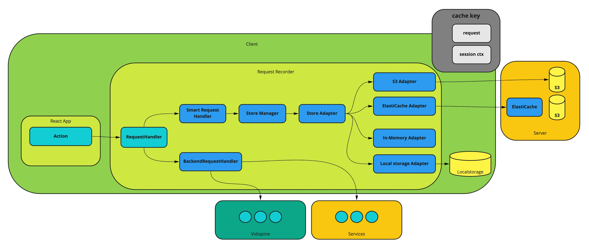

# Request Recorder

Request/Response Recorder for fast and predictable E2E regression testing (CI).

## Project structure

This repo contains both a web application and library files exposed in the `package.json` so the library can be consumed in an external web application.

### Web application

This project is a React Typescript project with a `src` folder for the application source files and `public` folder for the static web server assets, such as the `index.html` file.

To run the web server: `npm run develop`

### Library

The library files can be found in `src/library`.  

`library/recorder` contains the recorder functionality including the store and store adapters for various store backends.

`library/request` contains the request handler logic which leverages the recorder.

## Architecture



## Legacy request handler

The legacy request handler can be found in `library/request/legacy`.

The main entry point is the function `handleRequest` which takes:

- `request` a `Promise<Response>`
- `isPublicAccessible` whether the API is publicly accessible or private
- `redirectHandler` a function of the type `(url?: string) => void`

The function `handleResponse` handles the resulting response and accepts:

- `response` Fetch API interface representing the response to a request
- `isPublicAccessible` whether the API is publicly accessible or private
- `redirectHandler` a function of the type `(url?: string) => void`

## Advanced request handler

The advanced request handler can be found in `library/request/advanced`

The main file is `advanced-handle-request.ts` where the main entry point is the function `advHandleRequest`.

This function takes a `RequestParams` object with the following

- `request` a `Promise<Response>`
- `isPublicAccessible` whether the API is publicly accessible or private
- `redirectHandler` a function of the type `(url?: string) => void`
- `context` a context object describing the request

The main logic is as follows:

- create a `smartRequestHandler` and try to use it
- if a response is returned by the `smartRequestHandler`, return it
- if no response is returned, make a normal backend request

```js
    log && log(ctx);
    const requestHandler = createRequestHandler(params);
    const response = requestHandler.handle();
    if (response) return response;

    return handleBackendRequest({
        request,
        response,
        store,
        ctx,
        params,
        retryManager,
        redirectHandler,
        isPublicAccessible
    });
```

### Request context

The context object can take the following

- `store` the store manager to use for recording or for playback
- `actionWindow` the action window (latest number of actions) to use from the `sessionActionStack` to create a unique session key
- `log` optional custom log method
- `data` the data to send in the request
- `dataLabel` optional data label for logging and key purposes
- `apiType` the type of API call, such as `Backend` or `Service`
- `reqMethod` the request method used such as `GET` or `POST`
- `retryManager` retries manager

#### Smart Request Handler

The `SmartRequestHandler` should be used to handle:

- the storage of a response for a given request
- retrieval of a stored response for a given request

If `mockMode` is enabled (true) then the store will be used. Otherwise the default strategy will be used which is to call the actual backing endpoint (server)

Main methods

- `handle` handles the request given the `mockMode` and will try `retrieveMock` followed by `storeMockResponse`
- `retrieveMock` retrieves a mock (or cached) reponse from the store
- `storeMockResponse` stores a mock or recorded success reponse in the store
- `storeMockError` stores a mock or recorded error reponse in the store

Note that currently this handler operated under minimal assumptions and is not hardcoded to any specific implementation.

It expects a `record` object to be passed in which has an `error` method that can record an error and so on.

`record && record.error(ctx, mock.error);`

The user of the library will have to configure and implement this record object and may use the building blocks for recording that are part of the library or provide their own custom implementation.

#### Retries

The `advHandleRequest` method may optionally contain retry logic, to attempt making the request multiple times until it succeeds, times out or has used too many retry attempts. The retry strategy and implementation is completely up to the user of the library to implement.

A retries object can contain the following

- `shouldRetry` a function of the form `({response: string, params: RequestParams}) => boolean` to determine if the handler should retry the request
- `retry` a function of the form `<T = any>(ctx: any) => Promise<T>` which manages execution of retries
- `retryCtx: any` optional retry context which may contain number of retries, type of retry algorith/strategy, time info etc.
- `makeRetries` an optional function of the form `({retries, response, params, resp}) => Promise<{retryResponse: any; retriesMade: number}>` which handles making retries. A default `makeRetries` function will be used if none is supplied.

## handleBackendRequest

The function `handleBackendRequest` handles the backend request in terms of the response returned. If there is an error it throws a `NetworkError`.

The default response handling initiates `makeRetries` to handle retries in the case retries is enabled.

```js
const {retryResponse, retriesMade} = await makeRetries({
    retryManager,
    response,
    params,
    resp
});
```

Otherwise it records the time elapsed and records the response if recording is enabled.

```js
const timeElapsed = timeMs() - startTime;
// record response received
record.response &&
    record.response(ctx, {
        response: retryResponse || resp,
        retries: retriesMade || 0,
        time: timeElapsed
    });
// handle response
handleResponse({response, redirectHandler, isPublicAccessible});
```

It then handles the response using the existing (legacy) functionality of `handleRequest`.

See `handleResponse` and `handleContent`.

Perhaps refactor the function `handleBackendRequest` into a class `BackendRequestHandler` (or `BackendResponseHandler`?) using composition for `handleResponse` and `handleContent` that could also be refactored into classes `ResponseHandler` and `ContentHandler`, all with `handle` functions to handle the main logic.

## Store Manager

To create a Store Manager: `createStoreManager({retriever, recorder})`

The `retriever` should be a `StoreRetriever` and the `recorder` a `StoreRecorder`.

### Store Retriever

The method `async matchSuccess()` attempts to match a success request to a hit in the cache with pre-recorded response for the success keys.

The keys can be generated via the `StoreKeyGenerator`

- success key: `success:${apiType}:${reqMethod}:${apiId}`
- error key: `error:${apiType}:${reqMethod}:${apiId}`
- session key: hash of the session data object
- data key: `${dataLabel}:${dataHash}` optional data label and hash of the data

## Store

The store is currently assumed to be structured as follows:

```json
{
    "<success-key>": {
        "<session-key>": {
            "<data-key>": {
                // response data
            }            
        }
    }
}
```

However this is easy to customize by replacing the `StoreRetriever` and `StoreRecorder` with custom implementation with overrides for key methods.

If there is a miss on the top level success/error key:

```bash
{
    success: false,
    error: `No matching success item found for key: ${successResponseKey}`,
    store: store
}
```

If there is a miss on the session key:

```bash
{
    success: false,
    error: `No matching session item found for ${sessionKey}`,
    store: sessionsStore
}
```

If there is a miss on the data key:

```bash
{
    success: false,
    error: `No matching data found for ${dataKey}`,
    store: dataStore
}
```
